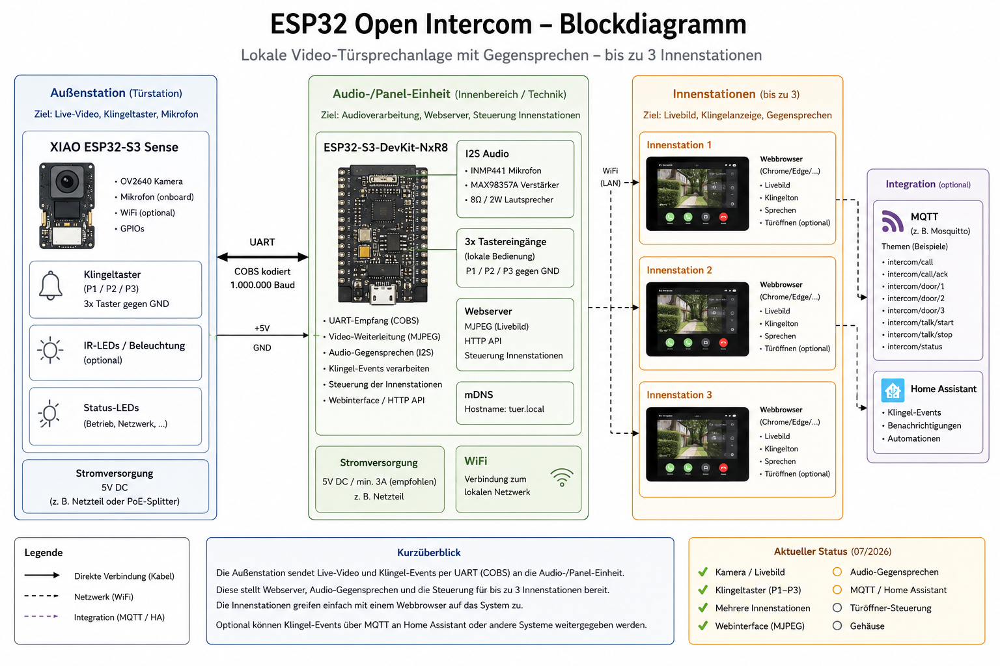

# ESP32 Open Intercom

> **Work in Progress**  
> Eine vollständig lokale Video-Türsprechanlage auf Basis von ESP32 – ohne Cloud, ohne Hersteller-App und komplett im eigenen Netzwerk.

---

## Projektziel

Dieses Projekt entstand aus dem Wunsch nach einer Video-Türsprechanlage, die

- vollständig lokal arbeitet,
- keine Cloud benötigt,
- keine Hersteller-App voraussetzt,
- auf preiswerter Standardhardware basiert,
- beliebig erweitert werden kann.

Der Schwerpunkt liegt auf einer offenen, nachvollziehbaren Lösung für Bastler und Maker.

---

## Aktueller Entwicklungsstand

| Funktion | Status |
|----------|:------:|
| Kamera | ✅ |
| Videostream (MJPEG) | ✅ |
| Bis zu drei Klingeltaster | ✅ |
| Mehrere browserbasierte Innenstationen | ✅ |
| Audio | 🚧 |
| Gegensprechen | 🚧 |
| MQTT | 🚧 |
| Home-Assistant-Anbindung | 🚧 |
| Dokumentation | 🚧 |

---

## Systemübersicht

Das System besteht aus zwei ESP32-S3-Modulen.

### Außenstation

- Seeed XIAO ESP32-S3 Sense
- OV2640 Kamera
- Klingeltaster
- Status-LEDs

Die Außenstation erzeugt den Videostream und erkennt Klingelereignisse.

### Controller

Das Projekt verwendet einen zweiten ESP32-S3 als zentrale Steuereinheit.

Er übernimmt

- die Kommunikation mit der Türstation,
- die Bereitstellung der Weboberfläche,
- die Audioausgabe,
- sowie künftig MQTT und die Home-Assistant-Anbindung.

Die Kommunikation zwischen beiden ESP32 erfolgt über eine schnelle UART-Verbindung.

---

## Bisher implementiert

- MJPEG-Livestream
- mehrere virtuelle Innenstationen
- browserbasierte Bedienung
- getrennte Kamera- und Audiohardware
- modularer Aufbau
- vollständig lokaler Betrieb

---

## Geplant

- Audio
- Gegensprechen
- MQTT
- Home-Assistant-Integration
- OTA-Updates
- Türöffner
- Konfigurationsoberfläche

Die Reihenfolge kann sich während der Entwicklung ändern.

---

## Hardware

### Außenstation

- Seeed XIAO ESP32-S3 Sense
- OV2640 Kamera

### Inneneinheit

- Waveshare ESP32-S3
- INMP441 Mikrofon
- MAX98357A Audioverstärker
- Lautsprecher

---

## Software

- Arduino IDE
- ESP32 Arduino Framework
- LittleFS
- AsyncWebServer
- mDNS

Weitere Komponenten werden im Laufe der Entwicklung ergänzt.

---

## Projektstatus

Dies ist kein fertiges Produkt.

Das Repository dokumentiert den Entwicklungsprozess. Manche Funktionen sind bereits nutzbar, andere befinden sich noch im Aufbau. Änderungen an Hardware, Software und Dokumentation sind jederzeit möglich.

---

## Mitmachen

Anregungen, Verbesserungsvorschläge und Pull Requests sind willkommen.

Wer das Projekt nachbauen möchte, sollte damit rechnen, dass sich Pinbelegungen, Hardware und Software bis zur ersten stabilen Version noch ändern können.

---

## Lizenz

Dieses Projekt steht unter der GNU General Public License v3.0 oder neuer (GPL-3.0-or-later).

Siehe die Datei `LICENSE` für den vollständigen Lizenztext.
